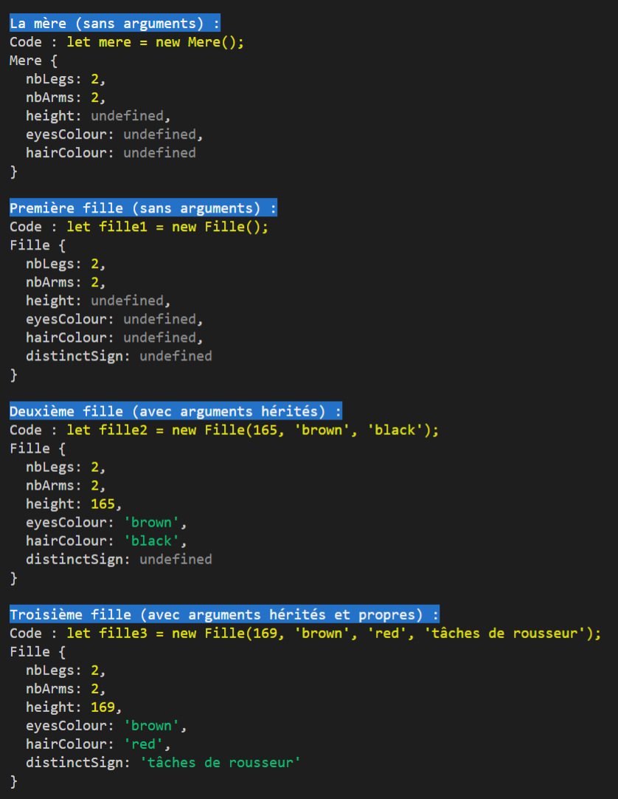
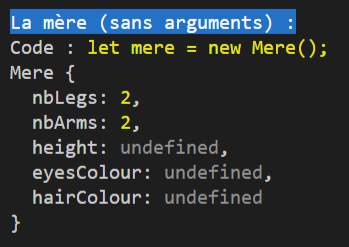
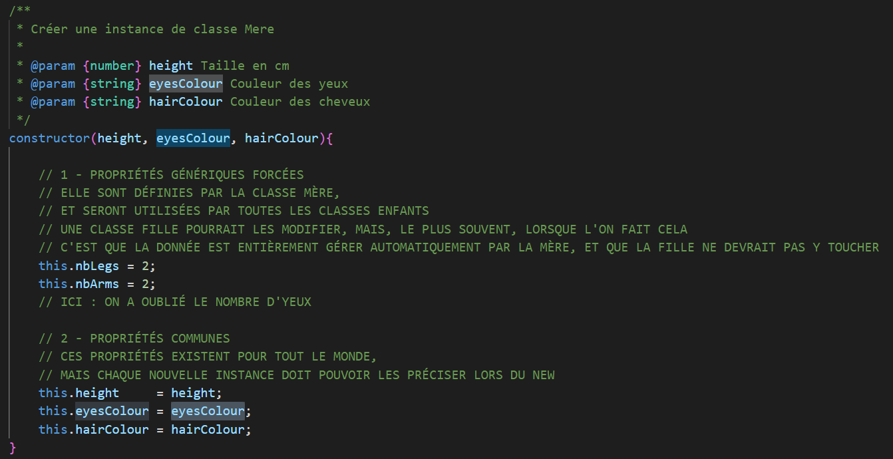
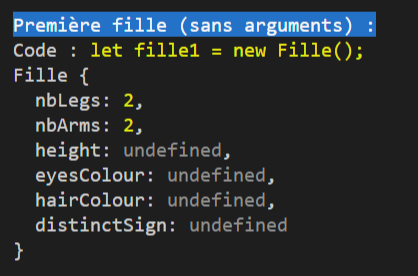
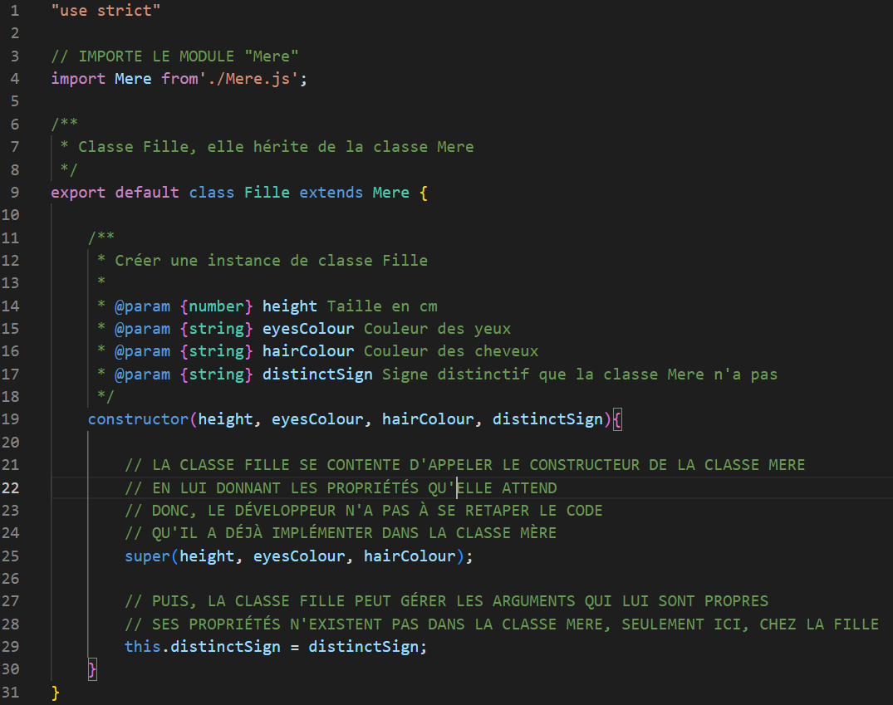
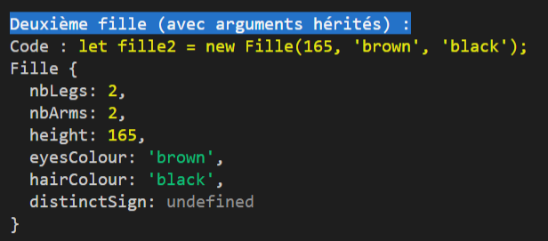
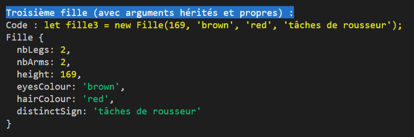
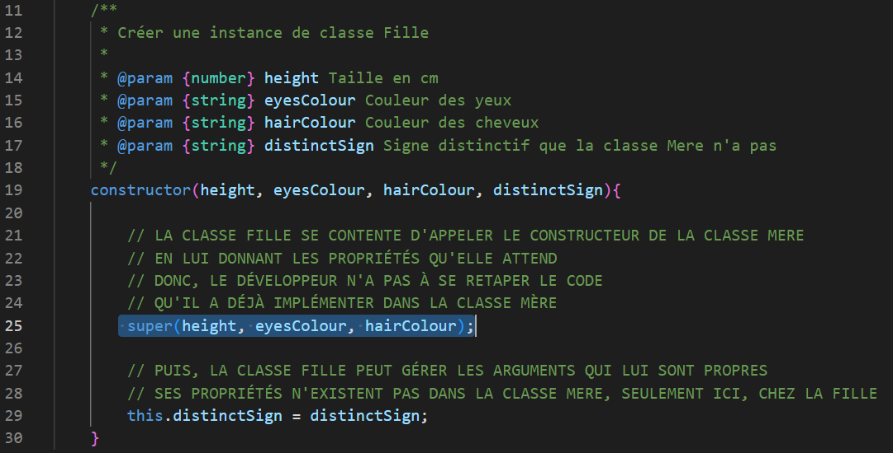

###### Intro à la programmation orientée objet

# L'héritage

## Problème de départ

Lors des exercice précédents, cous avez développez trois classes différentes :

- **Car**
- **Bike**
- **Truck**

Chacune de ces classes avait ses propres spécificitées. D'où l'un des intérêt de la programmation orientée objet.

Mais, pour ce qui est des données communes aux trois classes, comme la couleur, il a fallut développer trois fois le même code.

Cela n'est pas acceptable il faut trouver un moyen de ne faire le travail qu'une seul fois et que celui-ci soit chargé dans les trois classes.

C'est le concept de **l'héritage**.

Vous allez développer une nouvelle classe **Vehicle** qui sera la *"classe mère"* des classes **Car**, **Bike** et **Truck**. Et, par héritage (comme l'héritage génétique), elle transmettra certaines de ses propriétés à ses enfants.

## Exemple d'héritage

Pour le moment, vous n'allez pas travailler sur les classes **Vehicle**, **Car**, **Bike** et **Truck**. Nous allons regarder en détail un exemple déjà tout prêt.

**Exécutez la commande suivante :**
```
node .\oop-js-04-heritage.js
```

Vous devriez obtenir une sortie très verbeuse, il va vous falloir agrandir la taille de votre terminal.

**Sortie attendue :**



Le script est juste la création de quatres instances de classes, une de la classe *"Mere"* et trois de la classe *"Fille"* avec des arguments différents, chaque création d'instance étant suivie d'un **console.log()** de l'objet ainsi créé.

Ou, dit autrement : un **new** et un **console.log()** quatre fois.

### Première instance : la mère

**Sortie du terminal**



La sortie nous montre que le code exécuté est ```let mere = new Mere();``` et que le résultat est un objet de type **"Mere"** comportant cinq propriétés :

- **nbLegs** : le nombre de jambes, déjà initialisé à 2 par défaut
- **nbArms** : le nombre de brad, déjà initialisé à 2 également
- **height** : la taille, qui ici est non définie
- **eyesColour** : la couleur des yeux, qui ici est aussi non définie
- **hairColour** : la couleur des cheveux, qui est également non définie

Voyons le code du constructeur de la classe Mère pour mieux comprendre :



On voit bien, ici, que la mere attend seulement trois arguments : **height**, **eyesColour** et **hairColour**, que nous ne lui avons pas donné lors du *new*. Par contre, la classe se charge toute seule d'écrire la valeur *2* dans **nbLegs** et **nbArms**.

**Il y a donc deux types de propriétés :**
- certaines écrites *"en dur"* qui sont gérées automatiquement par la classe
- certaines qui doivent être définies par la suite, lors de la création de l'instance avec **new**

### Deuxième instance : première fille (sans arguments)

**Sortie du terminal**



Cette sortie est très, très, très proche de la précédente, pour ne pas dire identique. 

**À ceci prêt que :**

- le code exécuté est : ```let fille1 = new Fille();``` (ce n'est plus la même classe)
- le console.log de l'objet créé montre bien qu'il s'agit d'un objet de type **"Fille"** et non plus **"Mere"**

**Voyons le code de la classe Fille :**



Nous n'allons pas tout détailler pour le moment. 

**Seules trois lignes nous intéressent :**

- **ligne 04** : ici, on importe la classe **Mere**, car la classe **Fille** va avoir besoin d'elle pour en hériter
- **ligne 09** : à la fin de la création de la classe **Fille**, on a ajouter l'instruction ```extends Mere```. C'est précisément cette instruction qui dit que la classe **Fille** hérité de la classe **Mere**.
- **ligne 25** : une autre instruction nouvelle : ```super()```. Cette instruction dit, en substance, que la classe **Fille** n'a pas envie de s'embêter avec certains arguments et préfère les refiler à la classe **Mere**, qui elle sait parfaitement les gérer. Factuellement, l'instruction ```super()``` permet d'appeler le constructeur de la mère, depuis le constructeur de la fille.

Voici donc, l'une des magie de la programmation objet :

La classe *mère*, via son constructeur, étant déjà parfaitement capable de gérer les propriétés **height**, **eyesColour** et **hairColour** mais également d'initialiser automatiquements les propriétés **nbLegs** et **nbArms** à *2*, il n'est pas nécessaire de refaire ce code dans la classe *fille*, il y a juste à appeler le constructeur de la mère depuis celui de la fille.

Du coup, notre fille se retrouve bien avec ses deux bras et deux jambes. Alors que nulle part il n'en est question dans le code de la classe fille. 

Ses propriétés son hérités, automatiquement.

### Troisième instance : deuxième fille (avec arguments hérités)

**Sortie du terminal**



Le code utilisé cette fois est ```Deuxième fille (avec arguments hérités)```.

C'est exactement la même chose que pour l'objet précédent (```fille1```) sauf que, là, les valeurs des arguments **height**, **eyesColour** et **hairColour** sont précisés.

Du coup, si vous vérifiez à nouveau le code la classe **Fille**, et plus particulièrement la fameuse ligne *25*, vous verrez que ces arguments sont bien récupérés par la classe **Fille** et transmis grâce à l'instruction ```super()``` tels quels au constructeur de la classe **Mere**.

**La ligne 25 :**

```JavaScript
super(height, eyesColour, hairColour);
```

Ces propriétés ne sont pas imposées par la classe mère, mais c'est elle qui sait les traiter, donc on les lui laisse.

Du coup, dans la sortie du terminal, on constate bien que les arguments fournis lors du ```new``` sont passés de la fills à la mère, qui les a traité, et donc lors du ```console.log()```, on retrouve bien les valeurs pour chaque propriété.

Seule manque la propriété ```distinctSign``` qui elle ne peut être gérer par la classe **Mere** car elle ne la connait pas.

### Quatrième instance : troisième fille (avec arguments hérités et propres)

**Sortie du terminal**



Là, on profite vraiment des capacités de la programmation objet (il y a d'autres choses, mais c'est la base).

Notre code : ```let fille3 = new Fille(169, 'brown', 'red', 'tâches de rousseur');``` crée une instance de la classe **Fille** en lui donnant tous les arguments prévus déjà par la classe **Mere**, mais y ajoute, en plus un nouvel argument à la fin dont la valeur est ```'tâches de rousseur'```.

Cet argument, n'est pas prévu par la *mère*.

Mais, regardons à nouveau le constructeur de la classe **Fille** :



Notre ligne *25* et son ```super()``` transmettent bien les arguments **height**, **eyesColour** et **hairColour** au constructeur de la *mère*. Par contre, il n'est fait nul mention de l'argument **distinctSign**.

En revanche, ligne **29**, on voit que cet argument est enregistré dans une propriété du même nom.

**Donc :**

- **distinctSign** n'existe pas dans la classe **Mere**
- La classe **Fille** récupère les autres arguments et les transmet à la class **Mere**
- Par contre, elle gère elle même la récupération de **distinctSign**

Et voici pourquoi, cette propriété qui n'existait pas chez la mère, et parfaitement gérer par la fille, d'où la sortie du terminal qui montre bien que celle-ci à reçue la valeur spécifiée lors du new : ```'tâches de rousseur'```.